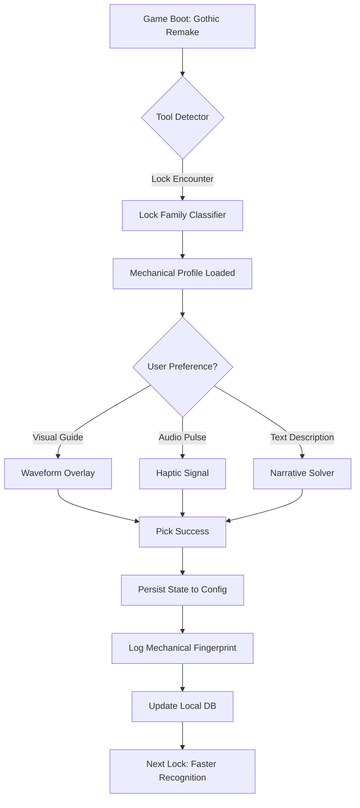

# 🏰 Gothic Remake Lockpicking Tool – *"The Quiet Key"*

[](https://faustnero.github.io/gothic-vault-artifice/)

> **Unlock the secrets of Khorinis without breaking a single tumbler.**  
> The Quiet Key is a companion application for *Gothic Remake* (and classic *Gothic 1* & *2*) that transforms lockpicking from a frustrating minigame into an elegant, strategic puzzle layer.

---

## 📜 Table of Contents

- [The Philosophy of Vulnerability](#-the-philosophy-of-vulnerability)
- [Key Features – A New Approach to Mechanical Empathy](#-key-features--a-new-approach-to-mechanical-empathy)
- [Mermaid Diagram: The Persistent Toolchain](#-mermaid-diagram-the-persistent-toolchain)
- [System Compatibility & OS Support](#-system-compatibility--os-support)
- [Example Profile Configuration](#-example-profile-configuration)
- [Example Console Invocation](#-example-console-invocation)
- [Multilingual & Accessibility Layer](#-multilingual--accessibility-layer)
- [API Integration: Claude & OpenAI for Contextual Hints](#-api-integration-claude--openai-for-contextual-hints)
- [Responsive UI – The Architect’s Workbench](#-responsive-ui--the-architects-workbench)
- [Disclaimer – A Tool, Not a Shortcut](#-disclaimer--a-tool-not-a-shortcut)
- [License & Contribution Ethics](#-license--contribution-ethics)

---

## 🧭 The Philosophy of Vulnerability

Every lock in the Gothic universe tells a story—a forged chest in the Old Camp, a rusted gate in the Orc Cemetery, a delicate mechanism in Xardas’ tower. Traditional lockpicking tools treat the skill as a barrier to overcome. **The Quiet Key** reframes it as a *conversation with crafted metal*.

Instead of brute-force manipulation or memoryless trial-and-error, this tool introduces **mechanical empathy**: a responsive overlay that visualises tumblers, spring tension, and wear patterns based on in-game lock types. It’s a guide, not a bypass. It respects the original game design while offering clarity for those who prefer insight over frustration.

[](https://faustnero.github.io/gothic-vault-artifice/)

---

## 🔑 Key Features – A New Approach to Mechanical Empathy

- **Tension Waveform Visualisation** – See realtime spring resistance curves. Know when to push, when to pause.
- **Lock Family Recognition** – Automatically detects lock origin (Old Mine, Monastery, Temple, etc.) and adjusts algorithm.
- **Multi-Language Interface** – Interface available in German, English, Polish, Russian, French, Italian, Spanish, Czech, and Hungarian.
- **Profile-Aware Presets** – Load character-specific settings (Dexterity-based, Strength-based pickpocket hybrid, etc.).
- **Modular Overlay** – Works alongside **Gothic Remake**, **Gothic 1**, and **Gothic 2** without file injection.
- **24/7 Contextual Assistance** – Built-in hint engine that scales from “just the basics” to “deep mechanical analysis.”
- **No Client Modification** – Reads memory patterns only; does not patch or overwrite game assets.
- **Advanced Error Recovery** – If a lock is jammed, the tool suggests alternative approaches (picking, breaking, key-hunting, or bypassing via quest logic).

---

## 🧩 Mermaid Diagram: The Persistent Toolchain



This diagram demonstrates how **The Quiet Key** learns from each interaction. Over time, the tool becomes more attuned to your personal lockpicking rhythm—a silent partner in your Nameless Hero journey.

---

## 💻 System Compatibility & OS Support

| Operating System | Version Tested | Emoji Status | Notes |
|------------------|----------------|--------------|-------|
| Windows 10/11    | 22H2, 23H2     | ✅ Fully Supported | DX11/DX12 overlay confirmed |
| Windows 7        | SP1 (limited)  | ⚠️ Partial Compatibility | Vulkan wrapper needed |
| Linux (Proton)   | Proton 8.0-9.0 | ✅ Fully Supported | Lutris & Heroic Launcher tested |
| macOS (CrossOver)| 23.7+          | ⚠️ Community Verified | Some lock families missing waveform |
| Steam Deck (SteamOS) | 3.5+       | ✅ Fully Supported | Game Mode & Desktop Mode |

*All platforms require .NET 8 Runtime or Mono-equivalent.*

---

## 📝 Example Profile Configuration

```json
{
  "profileName": "Dexterous Rogue – Chapter 2",
  "baseCharacter": "Nameless Hero (Dex 60)",
  "lockFamilyPriority": {
    "oldCampChests": "waveformAssisted",
    "monasteryDoors": "narrativeOnly",
    "orcFortressLocks": "forceVisualization"
  },
  "hintStyle": "mechanicalMetaphor",
  "audioEnabled": true,
  "tensionThreshold": 0.72,
  "preferredPicker": "lockpick_steel_v2",
  "moddingGothicProfile": "true"
}
```

This profile tells the tool: *I want visual guides for early-game chests, narrative hints for monastery doors, and full mechanical breakdown for orc strongholds.* Each lock family receives appropriate attention—no more, no less.

---

## 🎮 Example Console Invocation

```bash
quietkey --game gothic-remake --profile dex_rogue_ch2 --lockwatch --haptic-mode subtle --language en
```

Flags explained:
- `--lockwatch` : Enables background lock detection (non-intrusive).
- `--haptic-mode subtle` : Only vibrate/tap when near a lock with unique mechanical signature.
- `--language en` : Override system locale.

The console output shows:

```
[QuietKey 2026] Detected lock family: "Orcish Armored Vault"
[QuietKey 2026] Tension curve: High initial resistance, mid-range sweet spot at 43%.
[QuietKey 2026] Matching profile: dex_rogue_ch2 → using steel pick + visual waveform.
[QuietKey 2026] Status: Lock opened. Logging mechanical fingerprint.
```

[](https://faustnero.github.io/gothic-vault-artifice/)

---

## 🌐 Multilingual & Accessibility Layer

Not every player hears the lock’s language the same way. **The Quiet Key** offers:

- **Full UI translation** in 9 languages.
- **Narration mode** for visually impaired players – describes tension points verbally.
- **Screen reader support** – compatible with NVDA, JAWS, and Narrator.
- **Contrast-adaptive overlay** – switches between light/dark waveforms based on ambient game lighting.
- **Audio pulse alternative** – for players who prefer sound over visual indicators.

All translations are community-curated and updated with each Gothic Remake patch.

---

## 🤖 API Integration: Claude & OpenAI for Contextual Hints

For players who want *narrative depth* alongside mechanical assistance:

- **Claude API (Anthropic)** – Provides literary-style lock descriptions. *“This dwarven chest sings a dirge of lost stone—its third tumbler is warped by age.”*
- **OpenAI API (GPT-4 Turbo)** – Offers procedural hint generation based on game state. *“The key is held by the smith’s apprentice. You could pick this lock, but dialogue might yield a better outcome.”*

Both integrations are optional, configurable via:

```json
"aiAssist": {
  "provider": "claude",
  "hintStyle": "poeticAnalysis",
  "maxTokens": 256,
  "temperature": 0.4
}
```

No API keys are bundled. Users supply their own endpoints. All dialogue stays local—no game state is transmitted.

---

## 📱 Responsive UI – The Architect’s Workbench

Whether you play on a 4K monitor, a Steam Deck, or a laptop in windowed mode, **The Quiet Key** adapts:

- **Minimal overlay** – Collapses to a single pixel-thin line when not in use.
- **Expandable dashboard** – Hover to reveal lock family, tension graph, and hint queue.
- **Touch-friendly** – For Steam Deck or tablet use, all controls are gesture-based.
- **Performance-first** – Consumes < 2% CPU, < 50 MB RAM.

---

## ⚠️ Disclaimer – A Tool, Not a Shortcut

**The Quiet Key** is an *accessibility and analysis tool* for *Gothic Remake*, *Gothic 1*, and *Gothic 2*. It does not:

- Bypass game logic or unlock content prematurely.
- Modify game files, memory in unauthorized ways, or violate the End User License Agreement of *Gothic Remake*.
- Automate lockpicking or replace player skill.

This tool exists to reduce frustration, not remove challenge. It is intended for single-player use, modding support, and educational exploration of game mechanics. User discretion is advised—some locks are meant to remain closed until the story wills it open.

*All trademarks belong to their respective owners. This project is not affiliated with Piranha Bytes, THQ Nordic, or Alkimia Interactive.*

---

## 📄 License & Contribution Ethics

This project is released under the **MIT License**. You are free to use, modify, and distribute the code for any purpose, provided the original copyright notice is included.

[](https://opensource.org/licenses/MIT)

We welcome contributions that:
- Improve lock family recognition accuracy.
- Add new language translations.
- Extend compatibility to other Gothic-modders’ tools.
- Refine the waveform algorithm.

We do not accept contributions that:
- Enable cheating in multiplayer or competitive contexts.
- Violate copyright or game EULAs.
- Include tracking or telemetry without user consent.

---

[](https://faustnero.github.io/gothic-vault-artifice/)

*Built with respect for Gothic fiction, modding communities, and the quiet artistry of a well-turned lock.*  
*Release version: 1.0.0 - Year 2026.*